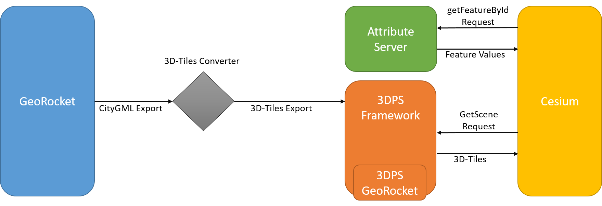
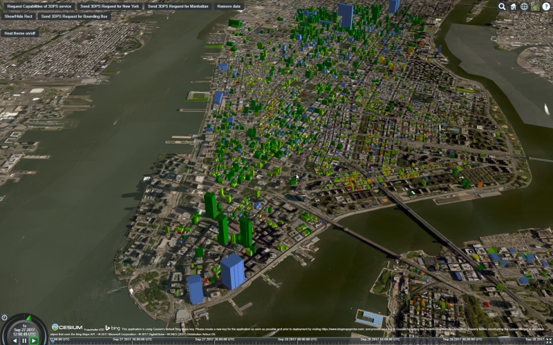
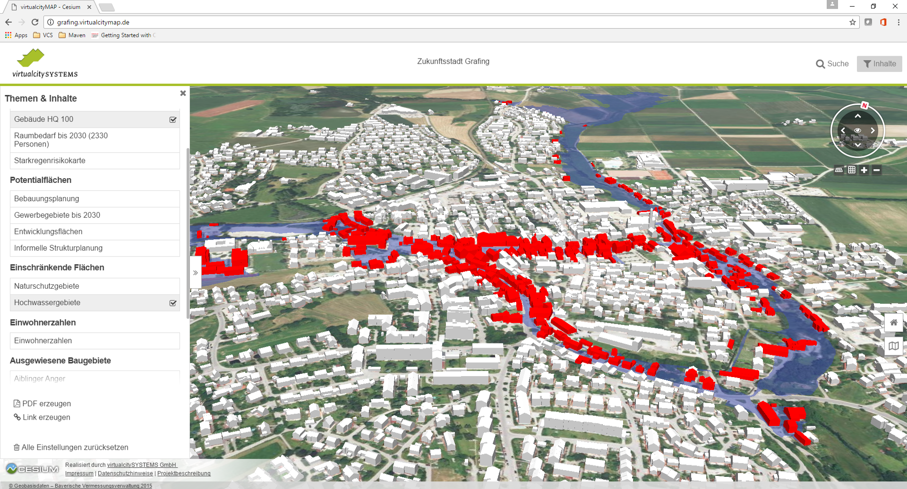

=== Building Heating demand simulation and visualization

==== Description

This use case is about using 3D city models to simulate the building's heating demand and visualize the results in a web-based 3D scene. Why is this relevant? The building sector has large potential for energy efficiency gains and CO~2~-reductions and is thus a priority area for achieving the ambitious climate and energy targets for 2020 and 2050 in the European Union cite:[bmwi2010]. In order to reach the 2% energy refurbishment rate promoted by the European Union and to realise long-term climate neutral communities, information about the current and future demand is necessary in order to develop strategies for policy making as well as to raise awareness of the citizens. Some pioneering work has already been done world wide cite:[Monien2017], cite:[Nouvel2015], cite:[CitySim], cite:[Chen2017]. As an input for the simulation, a building model in CityGML is usually used.
The use case is split into several parts:

* open a website to display a 3D map using 3D Portrayal Service and select a polygonal area / district
* query 3D building geometry inside the polygonal area from a CityGML data store using WFS 3.0 as an input to the simulation
* using 3D Portrayal Service and WFS 3.0 to query the simulation result and visualize it in a 3D scene by building Id, by address, and by polygonal area
* exend the use case to the INSPIRE 3D building module in addition to CityGML

The following aspects are covered by this use case:

* Querying features based on properties of related or nested objects or structured data types (one level / several levels)
* Querying feature data and returning only parts of the features (selected properties, a single property only, etc.)
* Querying feature data and returning additional features linked to the selected features
* Access to and query of solid geometries and other geometries in a 3D CRS
* Use of responses for display in a web browser

==== Data

* Open data 3D city model New York as used in Testbed 13 S3D performance. CityGML LoD 1/2 Building Model, no Textures
http://www1.nyc.gov/site/doitt/initiatives/3d-building.page; heating demand simulation is available (monthly energy balance) for Manhattan as "as is" simulation (simulated with SimStadt Software, HFT Stuttgart).
* Open data 3D model of Essen as used in the Energy and Location Pilot of the JRC. CityGML LoD 1/2 Building Model, no Textures; heating demand simulation is available (monthly energy balance) as "as is" simulation, medium refurbishment scenario, advanced refurbishment scenario (simulated with SimStadt Software, HFT Stuttgart).
* Open data 3D model of Essen, a test area converted from CityGML to INSPIRE building model using HALE Studio.

==== Sub Use Case: Open a website to display a 3D map using 3D Portrayal Service and select a polygonal area / district

This has been showcased and implemented in Testbed 13 cite:[Coors2018]. The implementation is available and could be further used and extended in Testbed 14 with the New York data set. The experiment evaluated the complete flow of data from its originating CityGML format to a web-enabled visualization with Cesium via OGC’s 3D Portrayal Service (3DPS). This data flow included the conversion from the CityGML data format served by GeoRocket, to 3D Tiles dataset, and the import of the 3D Tiles dataset to the 3DPS Framework.

A public demo is available at: http://tb13.igd.fraunhofer.de:8080/Apps/Sandcastle/index.html?src=3DPS_r.html&label=Showcases.

The following aspects are covered by this use case:

* Use of responses for display in a web browser (3DPS getScene Region query)

===== Query

A 3DPS getScene request example from the New York showcase:

link:http://tb13.igd.fraunhofer.de:8082/3dps?SERVICE=3DPS&VERSION=1.0&REQUEST=GetScene&LAYERS=manhattan&FORMAT=text/html&CRS=EPSG:4326&BOUNDINGBOX=-74.00635826977239,40.71778771238832,-73.97393297660074,40.75070138933127[http://tb13.igd.fraunhofer.de:8082/3dps? +
  SERVICE=3DPS& +
  VERSION=1.0& +
  REQUEST=GetScene& +
  LAYERS=manhattan& +
  FORMAT=text/html& +
  CRS=EPSG:4326& +
  BOUNDINGBOX=-74.00635826977239,40.71778771238832,-73.97393297660074,40.75070138933127]

CAUTION: The link appears to be broken.

In the existing implementation, 3D Tiles is used as content delivery format. See OGC Testbed 13 – 3D Tiles and I3S Interoperability and Performance Engineering Report cite:[Coors2018], link:http://docs.opengeospatial.org/per/17-046.html#Experiment2[experiment 2] for further details.

[#img_NY1,reftext='{figure-caption} {counter:figure-num}']
.3DPS getScene request to select an (bounding box) area of the New York data set
image::images/Testbed13-fig35-3DPS-NY-2.png[align="center"]

==== Sub Use Case: Using 3D Portrayal Service and WFS to query the simulation result and visualize it in a 3D scene by building Id

In Testbed 13, the 3DPS getFeatureInfo request has been used to query heating demand (simulation result) per building from a server at HFT Stuttgart. See link:https://www.youtube.com/watch?v=AbyCQKH-PC4&index=17&list=PLQsQNjNIDU87So4QmiSCKFmE0fv567s3m&t=0s[video] on the Testbed 13 S3D Performance Experiment #2.

It would make sense to user the building id to retrieve additional attributes from a WFS. But the building geometry is not wanted any more as it is already available.

[#img_NY2,reftext='{figure-caption} {counter:figure-num}']
.The dataflow from GeoRocket to the visualized 3D Tiles, which are requested via the 3DPS queries (from Testbed 13, S3D performance)


The following aspects are covered by this use case:

* Use of responses for display in a web browser (3DPS getScene Region query)
* Querying feature data and returning only parts of the features (selected properties, a single property only, etc.)

===== Query

A 3DPS getFeatureInfo request example from the New York showcase:

link:http://81.169.187.7:3100/api/v2/endpoint?service=3DPS&version=1.0&request=GetFeatureInfoByObjectId&objectid=uuid_2824afd6-00e5-42ac-ab95-ec868595dc5a&dataset=ny_dataset[http://81.169.187.7:3100/api/v2/endpoint? +
  SERVICE=3DPS& +
  VERSION=1.0& +
  REQUEST=GetFeatureInfoByObjectId& +
  OBJECTID=uuid_2824afd6-00e5-42ac-ab95-ec868595dc5a& +
  DATASET=ny_dataset]

As this is requesting feature properties, such a request could also be directed
to a WFS 2.0 with the building model. The building would be selected based on its
identifier using the `resourceId` parameter. The `property` parameter could be
used to select only the desired properties (in the example below: the building
function, the measured height and heat information); properties that are not
needed, for example, the geometry, would be excluded from the response.

```
https://www.example.com/wfs?
  service=WFS&
  version=2.0.2&
  request=GetFeature&
  namespaces=xmlns(bldg,http://www.opengis.net/citygml/building/2.0)&
  typenames=bldg:Building&
  resourceId=uuid_2824afd6-00e5-42ac-ab95-ec868595dc5a&
  propertyName=function,measuredHeight,heat
```

WFS 3.0 should include an extension that supports such a capability, too.

[#img_NY3,reftext='{figure-caption} {counter:figure-num}']
.Manhattan dataset with simulated heat demand, provided by HFT Stuttgart, and color coded in to the building’s appearance. (from Testbed 13, S3D performance)


==== Sub Use Case: Using WFS to query a feature from a city model by id

Most important in this use case is that solids are supported as feature geometries.

In addition, it needs to be discussed how to deal with the LoD concept of CityGML.
The CityGML model that is retrieved will typically be used by another process -
in our example the simulation of the heating demand of that building.

===== Query

```
https://www.example.com/wfs?
  service=WFS&
  version=2.0.2&
  request=GetFeature&
  namespaces=xmlns(bldg,http://www.opengis.net/citygml/building/2.0)&
  typenames=bldg:Building&
  resourceId=TWINHOUSE1
```

In WFS 3.0, the building would be identified by a URI, for example,
http://www.example.com/my-city-model/collections/buildings/items/TWINHOUSE1.

===== Result

As mentioned above, most important is that the result contains a solid geometry.

A WFS 2.0 would return the building feature in a `wfs:FeatureCollection`.

[source,xml]
----
<wfs:FeatureCollection xmlns:xAL="urn:oasis:names:tc:ciq:xsdschema:xAL:2.0" xmlns:gml="http://www.opengis.net/gml" xmlns:bldg="http://www.opengis.net/citygml/building/2.0" xmlns:wfs="http://www.opengis.net/wfs/2.0" xmlns:gen="http://www.opengis.net/citygml/generics/2.0" xmlns:core="http://www.opengis.net/citygml/2.0" xmlns:xlink="http://www.w3.org/1999/xlink" xmlns:xsi="http://www.w3.org/2001/XMLSchema-instance" xsi:schemaLocation="http://www.opengis.net/citygml/building/2.0 http://schemas.opengis.net/citygml/building/2.0/building.xsd http://www.opengis.net/wfs/2.0 http://schemas.opengis.net/wfs/2.0/wfs.xsd http://www.opengis.net/citygml/generics/2.0 http://schemas.opengis.net/citygml/generics/2.0/generics.xsd" timeStamp="2018-03-28T15:01:47" numberMatched="2" numberReturned="2">
 <wfs:member>
  <wfs:FeatureCollection timeStamp="2018-03-28T15:01:47" numberMatched="1" numberReturned="1">
   <wfs:member>
    <bldg:Building gml:id="TWINHOUSE1">
     <gml:boundedBy>
      <gml:Envelope srsName="crs:EPSG::31468" srsDimension="3">
       <gml:lowerCorner>-8.0E-15 0.0 0.0</gml:lowerCorner>
       <gml:upperCorner>10.04 10.04 6.4</gml:upperCorner>
      </gml:Envelope>
     </gml:boundedBy>
     <core:creationDate>2018-03-20</core:creationDate>
     <bldg:lod1Solid>
      <gml:Solid gml:id="UUID_836b4b28-24d9-4e83-906a-98f4364d351f">
       <gml:exterior>
        <gml:CompositeSurface gml:id="UUID_2ac22267-11d4-48f0-b63d-c417228d1968">
         <gml:surfaceMember>
          <gml:Polygon gml:id="UUID_e379198f-7e10-43e8-8737-851cece07579">
           <gml:exterior>
            <gml:LinearRing gml:id="UUID_e379198f-7e10-43e8-8737-851cece07579_0_">
             <gml:posList srsDimension="3">2.0E-15 10.04 0.0 4.0E-15 10.04 1.0E-13 -0.0 0.0 0.0 2.0E-15 10.04 0.0</gml:posList>
            </gml:LinearRing>
           </gml:exterior>
          </gml:Polygon>
         </gml:surfaceMember>
         <gml:surfaceMember>
          <gml:Polygon gml:id="UUID_0e264d5e-3034-43fc-b65f-2b231ef5907b">
           <gml:exterior>
            <gml:LinearRing gml:id="UUID_0e264d5e-3034-43fc-b65f-2b231ef5907b_0_">
             <gml:posList srsDimension="3">4.0E-15 10.04 1.0E-13 4.0E-15 0.0 1.0E-13 -0.0 0.0 0.0 4.0E-15 10.04 1.0E-13</gml:posList>
            </gml:LinearRing>
           </gml:exterior>
          </gml:Polygon>
         </gml:surfaceMember>
         <gml:surfaceMember>
          <gml:Polygon gml:id="UUID_c8dbcf60-8f0e-43f1-a1ef-ed43620dbfb1">
           <gml:exterior>
            <gml:LinearRing gml:id="UUID_c8dbcf60-8f0e-43f1-a1ef-ed43620dbfb1_0_">
             <gml:posList srsDimension="3">4.0E-15 10.04 1.0E-13 10.04 10.04 0.0 10.04 0.0 0.0 4.0E-15 0.0 1.0E-13 4.0E-15 10.04 1.0E-13</gml:posList>
            </gml:LinearRing>
           </gml:exterior>
          </gml:Polygon>
         </gml:surfaceMember>
         <gml:surfaceMember>
          <gml:Polygon gml:id="UUID_22c99934-a675-4b42-97af-f73874d1aabb">
           <gml:exterior>
            <gml:LinearRing gml:id="UUID_22c99934-a675-4b42-97af-f73874d1aabb_0_">
             <gml:posList srsDimension="3">10.04 0.0 6.4 10.04 0.0 0.0 10.04 10.04 0.0 10.04 10.04 6.4 10.04 0.0 6.4</gml:posList>
            </gml:LinearRing>
           </gml:exterior>
          </gml:Polygon>
         </gml:surfaceMember>
         <gml:surfaceMember>
          <gml:Polygon gml:id="UUID_13db3bd0-6210-414c-b884-3bd2099c9680">
           <gml:exterior>
            <gml:LinearRing gml:id="UUID_13db3bd0-6210-414c-b884-3bd2099c9680_0_">
             <gml:posList srsDimension="3">10.04 10.04 6.4 10.04 10.04 0.0 4.0E-15 10.04 1.0E-13 2.0E-15 10.04 0.0 -8.0E-15 10.04 6.39999999999999 10.04 10.04 6.4</gml:posList>
            </gml:LinearRing>
           </gml:exterior>
          </gml:Polygon>
         </gml:surfaceMember>
         <gml:surfaceMember>
          <gml:Polygon gml:id="UUID_024dfb16-831c-4404-9c94-cdda06aaca86">
           <gml:exterior>
            <gml:LinearRing gml:id="UUID_024dfb16-831c-4404-9c94-cdda06aaca86_0_">
             <gml:posList srsDimension="3">2.0E-15 10.04 0.0 -0.0 0.0 0.0 -8.0E-15 10.04 6.39999999999999 2.0E-15 10.04 0.0</gml:posList>
            </gml:LinearRing>
           </gml:exterior>
          </gml:Polygon>
         </gml:surfaceMember>
         <gml:surfaceMember>
          <gml:Polygon gml:id="UUID_a9f8e079-5033-49ed-851a-aae7f9454dd8">
           <gml:exterior>
            <gml:LinearRing gml:id="UUID_a9f8e079-5033-49ed-851a-aae7f9454dd8_0_">
             <gml:posList srsDimension="3">-8.0E-15 10.04 6.39999999999999 -0.0 0.0 0.0 -8.0E-15 0.0 6.39999999999999 -8.0E-15 10.04 6.39999999999999</gml:posList>
            </gml:LinearRing>
           </gml:exterior>
          </gml:Polygon>
         </gml:surfaceMember>
         <gml:surfaceMember>
          <gml:Polygon gml:id="UUID_a6d3c8c7-ace0-4e48-b8c1-ca18cd5a814d">
           <gml:exterior>
            <gml:LinearRing gml:id="UUID_a6d3c8c7-ace0-4e48-b8c1-ca18cd5a814d_0_">
             <gml:posList srsDimension="3">10.04 0.0 6.4 -8.0E-15 0.0 6.39999999999999 -0.0 0.0 0.0 4.0E-15 0.0 1.0E-13 10.04 0.0 0.0 10.04 0.0 6.4</gml:posList>
            </gml:LinearRing>
           </gml:exterior>
          </gml:Polygon>
         </gml:surfaceMember>
         <gml:surfaceMember>
          <gml:Polygon gml:id="UUID_c1b51c00-2dbc-45d2-9c93-c9b396382780">
           <gml:exterior>
            <gml:LinearRing gml:id="UUID_c1b51c00-2dbc-45d2-9c93-c9b396382780_0_">
             <gml:posList srsDimension="3">-8.0E-15 10.04 6.39999999999999 -8.0E-15 0.0 6.39999999999999 10.04 0.0 6.4 10.04 10.04 6.4 -8.0E-15 10.04 6.39999999999999</gml:posList>
            </gml:LinearRing>
           </gml:exterior>
          </gml:Polygon>
         </gml:surfaceMember>
        </gml:CompositeSurface>
       </gml:exterior>
      </gml:Solid>
     </bldg:lod1Solid>
     <bldg:lod1TerrainIntersection>
      <gml:MultiCurve>
       <gml:curveMember>
        <gml:LineString>
         <gml:posList srsDimension="3">10.04 0.0 0.0 10.04 10.04 0.0</gml:posList>
        </gml:LineString>
       </gml:curveMember>
       <gml:curveMember>
        <gml:LineString>
         <gml:posList srsDimension="3">-0.0 0.0 0.0 10.04 0.0 0.0</gml:posList>
        </gml:LineString>
       </gml:curveMember>
       <gml:curveMember>
        <gml:LineString>
         <gml:posList srsDimension="3">2.0E-15 10.04 0.0 -0.0 0.0 0.0</gml:posList>
        </gml:LineString>
       </gml:curveMember>
       <gml:curveMember>
        <gml:LineString>
         <gml:posList srsDimension="3">2.0E-15 10.04 0.0 10.04 10.04 0.0</gml:posList>
        </gml:LineString>
       </gml:curveMember>
      </gml:MultiCurve>
     </bldg:lod1TerrainIntersection>
    </bldg:Building>
   </wfs:member>
  </wfs:FeatureCollection>
 </wfs:member>
----

INSPIRE recommends the use of `wfs:FeatureCollection`, too, but if the data
is not accessed via a WFS other feature collections may be used as well.

CityGML itself also includes a feature collection element, `core:CityModel`,
that may be used, if the service interface is not a WFS 2.0.

[source,xml]
----
<core:CityModel xmlns:smil20="http://www.w3.org/2001/SMIL20/" xmlns:grp="http://www.opengis.net/citygml/cityobjectgroup/1.0" xmlns:smil20lang="http://www.w3.org/2001/SMIL20/Language" xmlns:xlink="http://www.w3.org/1999/xlink" xmlns:base="http://www.citygml.org/citygml/profiles/base/1.0" xmlns:luse="http://www.opengis.net/citygml/landuse/1.0" xmlns:xsi="http://www.w3.org/2001/XMLSchema-instance" xmlns:frn="http://www.opengis.net/citygml/cityfurniture/1.0" xmlns:dem="http://www.opengis.net/citygml/relief/1.0" xmlns:tran="http://www.opengis.net/citygml/transportation/1.0" xmlns:wtr="http://www.opengis.net/citygml/waterbody/1.0" xmlns:tex="http://www.opengis.net/citygml/texturedsurface/1.0" xmlns:core="http://www.opengis.net/citygml/1.0" xmlns:xAL="urn:oasis:names:tc:ciq:xsdschema:xAL:2.0" xmlns:bldg="http://www.opengis.net/citygml/building/1.0" xmlns:sch="http://www.ascc.net/xml/schematron" xmlns:app="http://www.opengis.net/citygml/appearance/1.0" xmlns:veg="http://www.opengis.net/citygml/vegetation/1.0" xmlns:gml="http://www.opengis.net/gml" xmlns:gen="http://www.opengis.net/citygml/generics/1.0">
  <core:cityObjectMember>
    <bldg:Building gml:id="TWINHOUSE1">
      ...
    </bldg:Building>
  </core:cityObjectMember>
</core:CityModel>
----

In WFS 3.0 the response will be determined by the encoding and the requirements
of the conformance class for that encoding.

None of the WFS 3.0 Core conformance classes for encodings supports solid
geometries.

However, for responses that are CityGML 2.0, the same `wfs30:FeatureCollection`
element could be used that is also used in the link:https://cdn.rawgit.com/opengeospatial/WFS_FES/3.0.0-draft.1/docs/17-069.html#_requirement_class_geography_markup_language_gml_simple_features_profile_level_0[WFS 3.0 conformance classes for the GML Simple Feature encodings].

Another option could be a WFS 3.0 that returns CityJSON.

==== Sub Use Case: Using WFS to query a 2D region from a city model

In this example, all buildings in a rectangular region are requested and
the selected building features are returned in a feature collection.

===== Query

Here is an example of a WFS 2.0 query:

```
https://www.example.com/wfs?
  service=WFS&
  version=2.0.2&
  request=GetFeature&
  namespaces=xmlns(bldg,http://www.opengis.net/citygml/building/2.0)&
  typenames=bldg:Building&
  BBOX=-74,40.7,-73.96,40.8
```

Using an instance of GeoRocket containing the New York City CityGML model
developed in Testbed 13 the request could also be:

http://192.44.35.62:63020/store/?search=-74,40.7,-73.96,40.8

In WFS 3.0, the request is also supported by the query capabilities of the Core,
for example:

http://www.example.com/my-city-model/collections/buildings/items?bbox=-74,40.7,-73.96,40.8

===== Results

The GeoRocket link from above points to a live service, but returns a large
response. A more manageable response can be retrieved with a
link:http://192.44.35.62:63020/store/?search=-74,40.75,-73.999999,40.7500001[smaller bounding box].

==== Sub Use Case: Using WFS to select buildings based on nested features or properties

These examples have been provided by Claus Nagel, virtualcitySYSTEMS. They cover
the following query categories:

* Querying features based on properties of related or nested objects or structured data types (several levels)
* Access to and query of solid geometries and other geometries in a 3D CRS

===== Query 1

This query retrieves all buildings having one or more ground surfaces whose
LoD2 geometry intersects with a given geometry. bldg:GroundSurface is a nested feature.

In this example, the query geometry is a multi surface with 3D coordinate values.

```
https://www.example.com/wfs?
  service=WFS&
  version=2.0.2&
  request=GetFeature&
  namespaces=xmlns(bldg,http://www.opengis.net/citygml/building/2.0)&
  typenames=bldg:Building&
  filter=
  <fes:Filter
    xmlns:bldg="http://www.opengis.net/citygml/building/2.0"
    xmlns:gml="http://www.opengis.net/gml/3.2"
    xmlns:fes="http://www.opengis.net/fes/2.0">
    <fes:Intersects>
      <fes:ValueReference>
        bldg:boundedBy/bldg:GroundSurface/bldg:lod2MultiSurface
      </fes:ValueReference>
      <gml:MultiSurface srsName="http://www.opengis.net/def/crs/EPSG/0/?????">
        <gml:surfaceMember>
          <gml:Polygon>
            <gml:exterior>
              <gml:LinearRing>
                <gml:posList>
                  21498.400088101323 17386.16611967112 31.123
                  <!-- ... -->
                </gml:posList>
              </gml:LinearRing>
            </gml:exterior>
          </gml:Polygon>
        </gml:surfaceMember>
      </gml:MultiSurface>
    </fes:Intersects>
  </fes:Filter>
```

===== Result

This result is shown as an image as the XML response itself is too verbose to
show, and is not open data.


[#img_VCS1,reftext='{figure-caption} {counter:figure-num}']
.Get all buildings having one or more ground surfaces whose LoD2 geometry intersects with a given geometry (Ground Surface is a nested feature in CityGML)


===== Query 2

Get all buildings along a given road. core:Address is a nested feature, and xAL requires access to an entire subtree of XML elements.

```
https://www.example.com/wfs?
  service=WFS&
  version=2.0.2&
  request=GetFeature&
  namespaces=xmlns(bldg,http://www.opengis.net/citygml/building/2.0)&
  typenames=bldg:Building&
  filter=
  <fes:Filter
    xmlns:bldg="http://www.opengis.net/citygml/building/2.0"
    xmlns:core="http://www.opengis.net/citygml/2.0"
    xmlns:xAL="urn:oasis:names:tc:ciq:xsdschema:xAL:2.0"
    xmlns:gml="http://www.opengis.net/gml/3.2"
    xmlns:fes="http://www.opengis.net/fes/2.0">
    <fes:PropertyIsLike wildCard="*" singleChar="." escapeChar="\">
      <fes:ValueReference>
        bldg:address/core:Address/core:xalAddress/xAL:AddressDetails/xAL:Country/xAL:Locality/xAL:Thoroughfare/xAL:ThoroughfareName
      </fes:ValueReference>
      <fes:Literal>Unter den Linden*</fes:Literal>
    </fes:PropertyIsLike>
  </fes:Filter>
```

===== Query 3

Get all trees that are given by an LoD3 template geometry and where this
geometry is within a distance to a given geometry. `core:ImplicitGeometry`
is a complex data type.

NOTE: In CityGML 3.0 ImplicitGeometry may become a feature type, too.

In this example, the geometry is a 3D point.

```
https://www.example.com/wfs?
  service=WFS&
  version=2.0.2&
  request=GetFeature&
  namespaces=xmlns(veg,http://www.opengis.net/citygml/vegetation/2.0)&
  typenames=veg:SolitaryVegetationObject&
  filter=
  <fes:Filter
    xmlns:veg="http://www.opengis.net/citygml/vegetation/2.0"
    xmlns:core="http://www.opengis.net/citygml/2.0"
    xmlns:gml="http://www.opengis.net/gml/3.2"
    xmlns:fes="http://www.opengis.net/fes/2.0">
    <fes:DWithin>
      <fes:ValueReference>
        veg:lod3ImplicitRepresentation/core:ImplicitGeometry/core:relativeGMLGeometry
      </fes:ValueReference>
      <gml:Point srsName="http://www.opengis.net/def/crs/EPSG/0/?????">
        <gml:pos>21498.400088101323 17386.16611967112 145.34675</gml:pos>
      </gml:Point>
      <fes:Distance uom="m">800</fes:Distance>
    </fes:DWithin>
  </fes:Filter>
```

===== Result 3

This result is shown as an image as the XML response itself is too verbose to
show, and is not open data.

CAUTION: The image does not fit to the query as buildings are shown, not trees;
this needs to be updated.

[#img_VCS3,reftext='{figure-caption} {counter:figure-num}']
.get all buildings within a given distance of a point
image::images/wfs_3_example3_VCS_result.png[align="center"]

===== Query 4

Get all buildings that have a thermal zone which contains a thermal boundary
whose `u` value is greater than a given value. This example uses the
CityGML EnergyADE 1.0 extension which adds energy information to the CityGML
base model.

The query involves three nested features: `energy:ThermalZone`,
`energy:ThermalBoundary` and `energy:Construction`.

```
https://www.example.com/wfs?
  service=WFS&
  version=2.0.2&
  request=GetFeature&
  namespaces=xmlns(bldg,http://www.opengis.net/citygml/building/2.0)&
  typenames=bldg:Building&
  filter=
  <fes:Filter
    xmlns:bldg="http://www.opengis.net/citygml/building/2.0"
    xmlns:energy="http://www.sig3d.org/citygml/2.0/energy/1.0"
    xmlns:gml="http://www.opengis.net/gml/3.2"
    xmlns:fes="http://www.opengis.net/fes/2.0">
      <fes:PropertyIsGreaterThan>
        <fes:ValueReference>
          energy:thermalZone/energy:ThermalZone/energy:boundedBy/energy:ThermalBoundary/energy:construction/energy:Construction/energy:uValue
        </fes:ValueReference>
        <fes:Literal>2.5</fes:Literal>
      </fes:PropertyIsGreaterThan>
    </fes:Filter>
  </wfs:Query>
</wfs:GetFeature>
```

===== Query 5

Get all roads with a traffic lane for bicycles.

This query involves the nested feature `tran:TrafficArea`.

```
https://www.example.com/wfs?
  service=WFS&
  version=2.0.2&
  request=GetFeature&
  namespaces=xmlns(tran,http://www.opengis.net/citygml/transportation/2.0)&
  typenames=tran:Road
  filter=
  <fes:Filter
    xmlns:tran="http://www.opengis.net/citygml/transportation/2.0"
    xmlns:gml="http://www.opengis.net/gml/3.2"
    xmlns:fes="http://www.opengis.net/fes/2.0">
    <fes:PropertyIsEqualTo matchCase="false">
      <fes:ValueReference>
        tran:trafficArea/tran:TrafficArea/tran:function
      </fes:ValueReference>
      <fes:Literal>cycleLane</fes:Literal>
    </fes:PropertyIsEqualTo>
  </fes:Filter>
```

===== Query 6

Get all buildings having one or more roof surfaces that are suitable for
mounting photovoltaic panels (the attribute `pc_class` stores the suitability
class which has been precomputed.

`bldg:RoofSurface` is a nested feature.

```
https://www.example.com/wfs?
  service=WFS&
  version=2.0.2&
  request=GetFeature&
  namespaces=xmlns(bldg,http://www.opengis.net/citygml/building/2.0)&
  typenames=bldg:Building&
  filter=
  <fes:Filter
    xmlns:bldg="http://www.opengis.net/citygml/building/2.0"
    xmlns:gen="http://www.opengis.net/citygml/generics/2.0"
    xmlns:gml="http://www.opengis.net/gml/3.2"
    xmlns:fes="http://www.opengis.net/fes/2.0">
    <fes:PropertyIsBetween>
      <fes:ValueReference>
        bldg:boundedBy/bldg:RoofSurface/gen:intAttribute[@gen:name='pv_class']/gen:value
      </fes:ValueReference>
      <fes:LowerBoundary>
        <fes:Literal>2</fes:Literal>
      </fes:LowerBoundary>
      <fes:UpperBoundary>
        <fes:Literal>3</fes:Literal>
      </fes:UpperBoundary>
    </fes:PropertyIsBetween>
  </fes:Filter>
```
